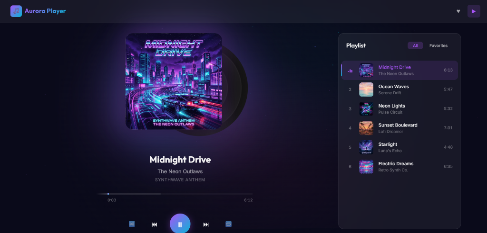
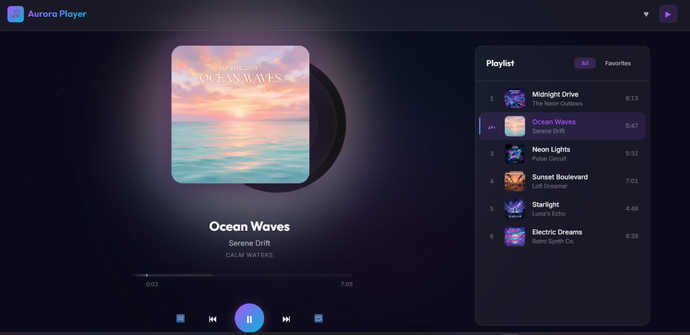

# 🎵 Aurora Player — Modern Web Music Player

[](https://www.codsoft.in/)
[](https://developer.mozilla.org/en-US/docs/Web/JavaScript)
[](https://developer.mozilla.org/en-US/docs/Web/HTML)
[](https://developer.mozilla.org/en-US/docs/Web/CSS)
[](LICENSE)

> A stylish, modern web-based audio player built with Vanilla JavaScript, HTML5 Audio API, and cutting-edge CSS Glassmorphism design. Features playlist management, real-time search, animated vinyl disc, equalizer waves, persistent favorites, shuffle, repeat, keyboard shortcuts, and full mobile responsiveness.

---

## 📸 Screenshots & UI Preview

<p align="center">
  
  
</p>

---

## ✨ Features

### 🎧 Core Playback Controls
- **Standard Controls**: Seamless Play, Pause, Next Track, and Previous Track functionality.
- **Track Information**: Displays track title, artist, album name, high-resolution artwork, and formatted duration.
- **Interactive Seek Bar**: Fluid progress bar showing current time, buffered progress, total duration, and drag/click seeking.
- **Volume & Mute**: Precise volume slider control, one-click mute/unmute toggle, and dynamic volume icons (`🔊`, `🔉`, `🔈`, `🔇`).
- **Real-Time Playback Time**: Smooth time display automatically updated throughout playback.

### 🚀 Advanced & Bonus Features
- **📀 Animated Vinyl Record**: Skeuomorphic vinyl disc slides out and spins smoothly while audio is playing.
- **🌊 Dynamic Audio Visualizer**: Pulsing audio wave bars that animate dynamically during playback.
- **⚡ Playback Speed Selector**: Cycle through `0.75x`, `1.0x`, `1.25x`, `1.5x`, and `2.0x` speeds with instant feedback.
- **📑 Playlist & Queue Management**: Full interactive playlist with numbered tracks, artwork thumbnails, and live equalizer bars on active tracks.
- **🔍 Real-Time Search**: Instant filter for tracks by song title, artist, or album with a one-click clear button.
- **💖 Persistent Favorites**: Favorite any song with the heart button (`♥`), saved persistently to `localStorage`, with a dedicated "Favorites" tab.
- **🔀 Smart Shuffle Mode**: Randomize playback using an unbiased Fisher-Yates shuffle queue.
- **🔁 Repeat Modes**: Three-state toggle for `Repeat Off`, `Repeat All`, and `Repeat One`.
- **▶️ Autoplay**: Automatically advances to the next track in queue when a song finishes.
- **⌨️ Keyboard Shortcuts & Modal**: Full keyboard navigation with a stylish pop-up dialog (`⌨️` or `?`).
- **🛡️ Web Audio Fallback**: Resilient audio engine with automatic Web Audio API synthesizer chords if network streaming is unavailable.
- **📱 Fully Responsive Design**: Fluid layout adapting seamlessly to desktops, tablets, and smartphones.

---

## ⌨️ Keyboard Shortcuts

| Key | Action |
| :--- | :--- |
| <kbd>Space</kbd> | Play / Pause |
| <kbd>→</kbd> | Seek Forward 5 Seconds |
| <kbd>←</kbd> | Seek Backward 5 Seconds |
| <kbd>↑</kbd> | Volume Up (+5%) |
| <kbd>↓</kbd> | Volume Down (-5%) |
| <kbd>M</kbd> | Toggle Mute / Unmute |
| <kbd>N</kbd> | Next Track |
| <kbd>P</kbd> | Previous Track |
| <kbd>S</kbd> | Toggle Shuffle Mode |
| <kbd>R</kbd> | Cycle Repeat Mode (`Off` → `All` → `One`) |
| <kbd>?</kbd> | Open Keyboard Shortcuts Modal |
| <kbd>Esc</kbd> | Close Modal Dialog |

---

## 🛠️ Technology Stack

- **Markup**: Semantic HTML5 with accessibility attributes (`aria-label`, `role="slider"`, `tabindex`).
- **Styling**: Vanilla CSS3 featuring:
  - Curated HSL dark palette with neon accents (`#a855f7`, `#06b6d4`, `#ec4899`).
  - Frosted glassmorphism (`backdrop-filter: blur(20px)`).
  - Floating ambient particle system and animated radial gradients.
  - CSS Grid & Flexbox responsive architecture.
  - Micro-interactions, bounce springs, and keyframe animations.
- **Logic**: Modular Vanilla JavaScript (ES6+):
  - `player.js` — Audio engine, HTMLAudioElement controller, Web Audio API synthesizer fallback.
  - `playlist.js` — Queue engine, Fisher-Yates shuffle, repeat state, search query filter, localStorage favorites.
  - `ui.js` — DOM manipulation, time formatting, progress rendering, particle animation, toast notifications.
  - `app.js` — Event orchestration, keyboard listener, state binding.

---

## 📂 Project Structure

```text
CODSOFT_TASKS2/
├── assets/
│   ├── album_electric_dreams.jpg    # Custom artwork
│   ├── album_midnight_drive.jpg     # Custom artwork
│   ├── album_neon_lights.jpg        # Custom artwork
│   ├── album_ocean_waves.jpg        # Custom artwork
│   ├── album_starlight.jpg          # Custom artwork
│   ├── album_sunset_boulevard.jpg   # Custom artwork
│   ├── preview_midnight_drive.png   # UI screenshot (Midnight Drive)
│   └── preview_ocean_waves.png      # UI screenshot (Ocean Waves)
├── css/
│   └── style.css                    # Glassmorphism design system & responsive styling
├── js/
│   ├── app.js                       # Application entry point & event wiring
│   ├── player.js                    # HTML5 Audio & Web Audio API engine
│   ├── playlist.js                  # Playlist management, search, favorites
│   └── ui.js                        # UI controllers, modal, toast, animations
├── index.html                       # Semantic HTML5 web player structure
├── .gitignore                       # Git ignore rules
├── LICENSE                          # MIT License
└── README.md                        # Documentation & setup guide
```

---

## 🚀 Getting Started

No build tools, bundlers, or dependencies are required. Aurora Player runs purely in standard web browsers!

### Option 1: Live Server / Local Web Server
1. Clone the repository:
   ```bash
   git clone https://github.com/sunilshaww/CODSOFT_TASKS2.git
   cd CODSOFT_TASKS2
   ```
2. Serve locally with any static server:
   ```bash
   # Using npx serve:
   npx serve .
   
   # Or using Python:
   python -m http.server 5500
   ```
3. Open `http://localhost:5500` in your web browser.

### Option 2: Direct Browser Launch
Simply double-click `index.html` to open it in Google Chrome, Firefox, Microsoft Edge, or Safari.

---

## 👨‍💻 Author

**Sunil Shaw**
- GitHub: [@sunilshaww](https://github.com/sunilshaww)
- Project: CodSoft Web Development Internship — Task 2

---

## 📜 License

This project is licensed under the [MIT License](LICENSE).
